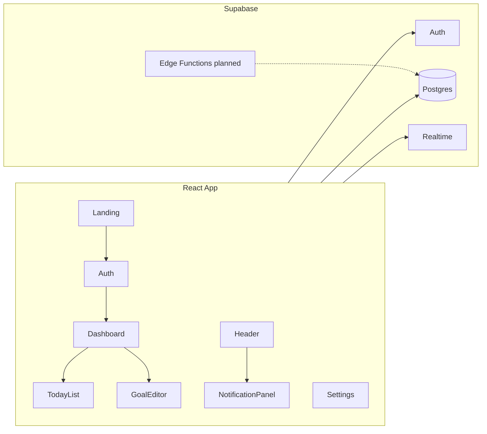

# DayForge — Project Handoff

> Last updated: 2026-06-17  
> **Copilot plan source:** [App Idea for Daily Goal Tracking](https://copilot.microsoft.com/shares/kLqEjZCujsG5tdLLERGAS) — distilled in [`COPILOT_PLAN.md`](COPILOT_PLAN.md)

## Product Vision

**DayForge** helps users translate high-level aspirations into daily habit loops — set goals, break them into tasks, track progress, and get email reminders.

- **Copilot tagline:** *"Forge better days, one goal at a time."*
- **Landing copy:** *"Forge your days. Command your future."*

Monetization (from Copilot): avoid selling user data; target freemium/subscriptions/B2B later. Web MVP first, full mobile app after validation.

## Tech Stack

| Layer | Copilot plan | Current build |
|-------|--------------|---------------|
| Frontend | React + Vite + Tailwind | React 19 + Vite + **custom CSS** (glass-panel) |
| Routing | — | React Router 7 |
| Backend | Supabase | Supabase (+ localStorage mock fallback) |
| Email | Postmark or Resend via Edge Functions | Not wired |
| Deploy | Vercel | Not configured |
| Icons | — | lucide-react |

## Architecture



### Routes

| Path | Component | Auth |
|------|-----------|------|
| `/` | Landing | Public |
| `/auth` | SignIn | Public |
| `/dashboard` | Dashboard | Protected |
| `/settings` | Settings | Protected |

### Data Model

| Table | Purpose | Copilot columns | In repo migration |
|-------|---------|-----------------|-------------------|
| `profiles` | User profile | `id`, name fields | `001` |
| `goals` | Milestones | full spec | `001` |
| `tasks` | Daily actions | + `order_index`, `recurring_rule` | `001` + `003` |
| `milestones` | Goal checkpoints | per Copilot | `003` (UI pending) |
| `notifications` | Email/reminders | per Copilot | `001` |

Migrations: [`supabase/migrations/`](supabase/migrations/) — run 001 → 002 → 003 in order.

## Copilot MVP vs Current Build

### Done (matches Copilot web MVP)

| Feature | File(s) |
|---------|---------|
| Landing page + feature grid + email capture UI | `src/pages/Landing/Landing.tsx` |
| Email/password auth + Google OAuth button | `src/pages/Auth/SignIn.tsx`, `src/lib/hooks/useAuth.ts` |
| Protected routes + AppShell | `src/App.tsx`, `src/components/layout/AppShell.tsx` |
| Two-column dashboard (Today + Goals) | `src/pages/Dashboard/Dashboard.tsx` |
| Task add/toggle/delete + goal linking | `src/pages/Dashboard/TodayList.tsx` |
| Goal creation modal | `src/pages/Goal/GoalEditorModal.tsx` |
| Goal progress auto-calculation | `TodayList.tsx` |
| Task reminders stored as notifications | `TodayList.tsx` |
| Notification panel + header badge | `NotificationPanel.tsx`, `Header.tsx` |
| Settings: profile, theme, JSON export | `src/pages/Settings/Settings.tsx` |
| Profile on sign-up trigger + RLS | `supabase/migrations/` |
| User-scoped queries | Dashboard, Settings (handoff fix) |
| Mock Supabase for offline dev | `src/lib/supabaseClient.ts` |

### Partial / stubbed

| Copilot requirement | Current state |
|---------------------|---------------|
| Task **reorder** + `order_index` | Column in `003`; no drag-and-drop UI |
| Goal **edit/delete** | Create only |
| **Milestones** on goals | Table in `003`; no UI |
| **Recurring** tasks | Column in `003`; no UI |
| **Real streak** + weekly sparkline | Mock streak in Dashboard |
| **Email delivery** | DB records only; no Edge Function |
| **Account deletion** | Clears localStorage; no Supabase Auth delete |
| **Newsletter** backend | UI-only on landing |
| **Analytics events** | Not implemented |
| **Tailwind CSS** | Custom CSS instead |
| **GoalCard / TaskItem** | Inline in Dashboard/TodayList |
| **Apple OAuth** | Hook exists; no UI button |
| **CI/CD + Vercel** | Not set up |

### Full app (Copilot — deferred)

- Push notifications, habit tracking, social/accountability, AI insights, subscriptions

## Code Map

```
src/
├── App.tsx
├── lib/
│   ├── supabaseClient.ts
│   └── hooks/useAuth.ts
├── pages/
│   ├── Landing/Landing.tsx
│   ├── Auth/SignIn.tsx
│   ├── Dashboard/{Dashboard,TodayList}.tsx
│   ├── Goal/GoalEditorModal.tsx
│   └── Settings/Settings.tsx
└── components/
    ├── layout/{AppShell,Header}.tsx
    └── domain/NotificationPanel.tsx
```

See [`COPILOT_PLAN.md`](COPILOT_PLAN.md) for the full component spec and API surface Copilot defined (REST endpoints replaced by direct Supabase client + RLS).

## Supabase Setup

All four core tables respond via REST when `.env` is configured.

1. Run [`001_dayforge_schema.sql`](supabase/migrations/001_dayforge_schema.sql)
2. Run [`002_rls_policies.sql`](supabase/migrations/002_rls_policies.sql)
3. Run [`003_copilot_extensions.sql`](supabase/migrations/003_copilot_extensions.sql) — milestones + task columns

Enable Realtime on `tasks`, `goals`, `notifications` in Supabase Dashboard → Database → Replication.

Auth: enable Email + Google (and Apple if desired) in Supabase Auth providers.

## Recommended Next Steps

Aligned with Copilot Week 2–3 remaining work:

1. **Goal edit/delete** — extend `GoalEditorModal.tsx`
2. **Task reorder** — drag-and-drop in `TodayList.tsx`, persist `order_index`
3. **Edge Function** — cron job to send `notifications` via Resend/Postmark
4. **Real streak** — compute from daily task completion history
5. **Milestones UI** — add to goal editor
6. **Deploy** — Vercel + env vars + optional GitHub Actions CI

## Environment

See [`.env.example`](.env.example): `VITE_SUPABASE_URL`, `VITE_SUPABASE_ANON_KEY`, optional `EMAIL_PROVIDER_API_KEY` for Edge Functions.
